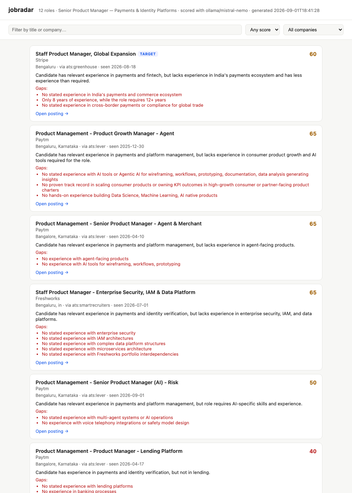

# jobradar

Local, AI-matched job discovery. Pulls open roles from public job-board APIs
and a large daily-refreshed index, scores each one against **your actual
profile** with an LLM — free and local via Ollama, or your own Anthropic/OpenAI
key — and gives you a ranked, explained shortlist in a small local web page.
When you find one worth applying to, `tailor` generates a resume and cover
letter grounded in your real background, verified to fit exactly one page.

No login. No scraping by default. **No auto-applying, ever** — this tool finds,
ranks, and helps you write for roles; you decide what to submit.



## Why

Most "AI job finder" tools are either keyword search with a sprinkle of AI
branding, or auto-apply bots that spray your resume at hundreds of postings —
and often ship stealth browser automation to dodge platform bot-detection,
which risks getting your account banned. Neither is what a senior candidate
usually wants.

jobradar does one thing: **tell you honestly how well a specific job actually
fits you**, with a genuine LLM reading the real job description against your
real background — not overlap-of-keywords dressed up as a score. It's told
explicitly not to invent qualifications you don't have, and to name real gaps
("this role wants 12+ years, you have 8" ) rather than smooth them over.

## Quickstart

```bash
git clone https://github.com/anveetmehta/jobradar.git
cd jobradar
python3 -m venv .venv && .venv/bin/pip install -r requirements.txt

.venv/bin/python jobradar.py init      # creates config.json + profile.json from the examples
# now edit config.json (location, target companies, AI backend)
#      and profile.json (your real background — see "Your profile" below)

.venv/bin/python jobradar.py verify    # sanity-check your ATS company list
.venv/bin/python jobradar.py scan      # fetch + AI-score + rank -> data/results.json
.venv/bin/python jobradar.py serve     # opens http://localhost:8765 with the ranked list

.venv/bin/python jobradar.py tailor 3  # one-page resume + cover letter for result #3
```

`config.json` and `profile.json` are gitignored — they hold your job search
and are never committed, even if you fork this repo.

## Choosing an AI backend

Set `ai.backend` in `config.json` to one of:

| backend | cost | privacy | setup |
|---|---|---|---|
| `ollama` | free | runs entirely on your machine, nothing leaves it | install [Ollama](https://ollama.com), `ollama pull <model>` |
| `anthropic` | pay per token | job descriptions + your profile go to Anthropic | `export ANTHROPIC_API_KEY=...` |
| `openai` | pay per token | job descriptions + your profile go to OpenAI | `export OPENAI_API_KEY=...` |

**Never put an API key in `config.json`** — it's read from your shell
environment only, so it can't end up committed by accident.

### Recommended local models (Ollama)

No GPU or paid API required. Pick one and `ollama pull` it:

| model | size | notes |
|---|---|---|
| `mistral-nemo` | ~7GB | best structured-output reliability in testing; the default |
| `qwen2.5:7b` | ~4.7GB | strong reasoning for its size, smaller download |
| `llama3.1:8b` | ~4.7GB | solid general baseline, widely used |
| `gemma2:9b` | ~5.4GB | good alternative if the others are already busy on your machine |

Local models are slower than a cloud API and occasionally return malformed
JSON — jobradar retries the extraction and, on total failure, falls back to
a keyword-prescreen rank for that one posting rather than crashing the run
(check `ai_error` in `data/results.json` for any that fell back).

## Your profile

`profile.json` is a JSON description of your real background — headline,
years of experience, skills, work history with concrete highlights, and any
free-text notes you want the AI to weigh (dealbreakers, seniority
preference, "flag it if the role wants N+ years more than I have"). See
`examples/profile.example.json` for the schema. **The match quality is only
as honest as what you put here** — the model is instructed not to invent
anything beyond it, so a thin profile produces thin, low-confidence scoring.

## Tailoring a resume and cover letter

```bash
jobradar.py tailor 3                 # tailor for result #3 from your last `scan`
jobradar.py tailor https://...        # or tailor directly against any posting URL
```

For the chosen posting, the AI reads your `profile.json` and the real job
description, then selects, reorders, and lightly tightens your **existing**
bullets and skills for relevance — it does not invent new ones. Output goes
to `output/<company>_<role>_resume.html` and `..._cover_letter.html`
(gitignored, personal to your run).

**One page, verified, not asserted.** Each file is rendered with a headless
browser (Chrome, Chromium, or Edge — whichever is already on your machine)
and its actual page count is measured. If it doesn't fit, jobradar retries at
a tighter type density, then trims the lowest-priority bullet or paragraph
one at a time — re-measuring after every change — until it fits or a small
cut budget runs out. If no browser is found at all, jobradar says so
explicitly rather than silently shipping an unverified file.

**Read the output before you send it — this is not optional.** Testing this
against a free local 7B model (`mistral-nemo`) surfaced a real failure: in
one run, the model added "AI tools" to the skills line — a skill genuinely
absent from the test profile — in the same response where it correctly
listed "no AI tools experience" as an unmet requirement. A separate run's
cover letter, while honestly acknowledging a stated experience gap, then
softened it with *"I've used other AI tools"* — a claim the profile never
made. Prompt instructions alone don't reliably stop this.

jobradar now runs two automated checks after generation, and reports what
they catch:
- `skills_line` is hard-filtered against your actual `profile.json` skills —
  anything the model adds that isn't really there is stripped, and you're
  told what was removed.
- Generated cover-letter text is scanned for "I've used X" / "I have
  experience with X" phrasing where X doesn't trace back to anything in your
  profile, and flagged as a warning for you to check.

The second check is a heuristic, not a guarantee — it catches the pattern
found in testing, not every possible way a model could embellish. Treat
`jobradar.py tailor`'s output as a strong first draft from someone who read
your resume carefully, not as ground truth ready to submit unread.

## Sources — what's queried, and the tradeoffs

| source | what it is | risk |
|---|---|---|
| **index** (default on) | [Feashliaa/job-board-data](https://github.com/Feashliaa/job-board-data) — ~1.4M postings from ~20k companies across Greenhouse, Lever, Ashby, Workday, BambooHR, iCIMS, and Paylocity, refreshed daily. jobradar only reads its public static JSON feed. | None — public data, no auth. Workday-hosted postings in this index carry title/company/location only (Workday gates full descriptions behind a browser session), so they're scored on title alone; treat a low score on a Workday row skeptically. |
| **ats** (default on) | Your `ats_companies` list, queried live against Lever/Greenhouse/Ashby/SmartRecruiters' own public JSON APIs — the same endpoints those platforms' "embed on your careers page" widgets use. | None — public, unauthenticated, read-only. Fresher than the index (minutes, not a day) but only covers companies you list. |
| **jobspy** (default **off**) | Indeed and LinkedIn via [python-jobspy](https://github.com/speedyapply/JobSpy). | This one scrapes rather than calling a documented public API. LinkedIn's ToS prohibits automated access; treat this as a personal-use, use-at-your-own-risk source, not something to run at volume. Naukri is wired up in JobSpy but reliably returns `406 recaptcha-required` without a residential proxy, so it's effectively unusable here as-is. |

Enable jobspy with `"sources": {"jobspy": true}` in `config.json` and
`pip install -r requirements-jobspy.txt`.

## Commands

```
jobradar.py init                copy example config/profile to get started
jobradar.py scan                fetch, AI-score, rank -> data/results.json
jobradar.py scan --fast         skip AI scoring entirely (instant, keyword rank only)
jobradar.py scan --fresh        bypass the cached index download and re-fetch it
jobradar.py verify              health-check every board in ats_companies
jobradar.py serve [--port N]    serve the web UI (default http://localhost:8765)
jobradar.py tailor <ref>        one-page resume + cover letter; ref is a result
                                 number from the last scan, or a posting URL
```

## Config reference

See the inline `_..._note` fields in `examples/config.example.json` — they
document every key in place rather than drifting out of sync with a separate
reference doc. Briefly: `location_filter` and `title_include`/`title_exclude`
are a cheap pre-filter before any AI call is spent; `ai.max_jobs_to_score`
caps how many postings actually get scored (ranked into that budget by a
quick keyword prescreen first); `target_companies` pins matches to the top of
the list regardless of score, badged in the UI.

## What this deliberately does not do

- **No auto-applying.** jobradar produces a ranked list with reasoning; a
  human decides what to submit and how to tailor it.
- **No credential-based scraping or bot-detection evasion.** Every default
  source is a public, unauthenticated API. jobspy is the one exception, is
  off by default, and is documented as such above.
- **No telemetry.** Nothing about your search, profile, or results leaves
  your machine except the API calls you configure (Ollama stays local;
  Anthropic/OpenAI only if you choose those backends). Your `contact` block
  (email/phone/LinkedIn) is used only to render the resume/cover-letter
  header locally — it is never included in what's sent to an AI backend.
- **`tailor` never submits anything.** It writes files to `output/` for you
  to review, open, and send yourself.

## Contributing

PRs welcome — new ATS adapters, more source connectors, UI improvements. If
you add a company to your local `ats_companies` and want to contribute a
useful default list for a particular industry or region, consider proposing
it in `examples/`.

## License

MIT — see [LICENSE](LICENSE).
